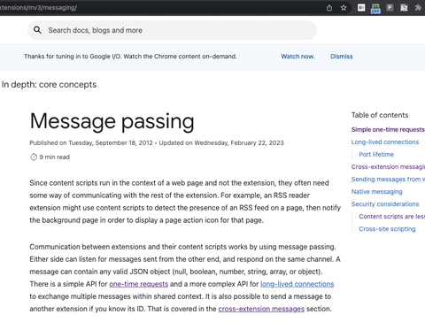
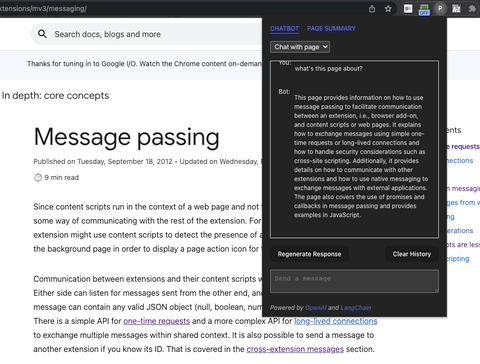

# PageChat

A Chrome extension that allows you to access ChatGPT from any webpage as well as ask questions about the page you are on or summarize it. 





The extension is built with [React](https://react.dev/) and [Vite](https://vitejs.dev/). It also uses the Vite plugin [
CRXJS](https://crxjs.dev/vite-plugin/) which parses the extension's entry file [manifest.json](manifest.json) and ensures that files referenced in it are compiled and bundled. 

## Develop

You can run the extension in development mode using the following commands:

```bash
npm install 
npm run dev
```

Then, go to `chrome://extensions/` and enable `Developer mode` in the top right corner. Then click `Load unpacked` and select the `dist` folder in the project directory. The extension should now be installed and ready to use.

Changes to the code will be automatically reflected in the extension without having to reload the extension.

## Build

To build the extension in production mode, run the following command:

```bash
npm run build
```

Then load the `dist` folder as an unpacked extension as described above.